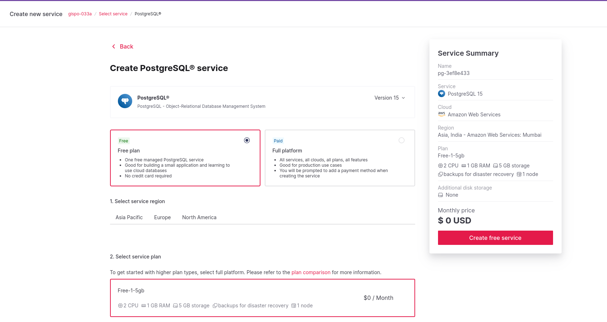
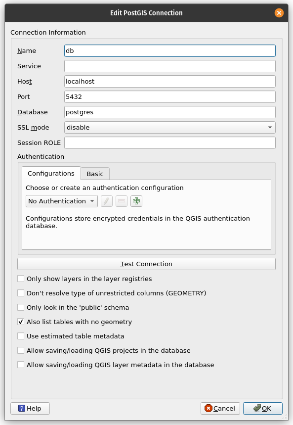
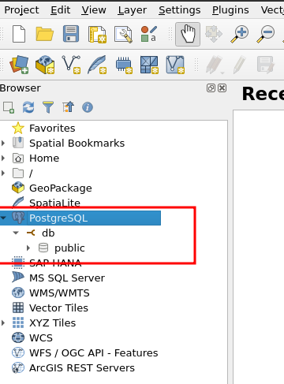
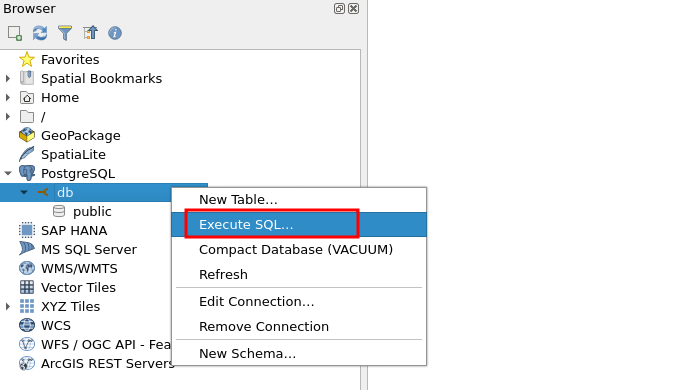
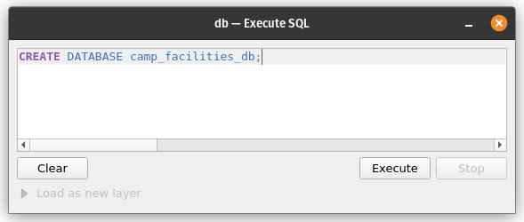
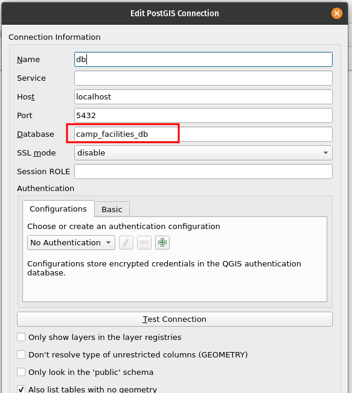

# Exercise 1: Database Creation and Integration

Imagine you are the Head of GIS or any other GIS representative in the Refuge Camp in Chattogram, Bangladesh, working for the International Organization for Migration (IOM). 

### Installation and Configuration: QGIS

You will need QGIS for this workshop. If you already have QGIS installed, great! It is recommended to use the latest Long-Term Release (LTR) version, which can be downloaded from the official QGIS website: <https://www.qgis.org/en/site/forusers/download.html>. Due to workshop schedule constraints and potential internet limitations, if you already have an earlier version of QGIS installed on your computer, you can use that version for the workshop.

However, it is still recommended to have the latest Long-Term Release (LTR) version of QGIS to ensure compatibility and access to the most up-to-date features.

### Installation and Configuration: PostgreSQL

You have the flexibility to choose between two workshop setups: deploying a PostgreSQL database on your local computer or utilizing a remote cloud provider, such as Aiven, for your database needs.

Use the following table to guide your choice of setup.

+-------------------------------+-----------------------------------------------------------------------------------------------------------------+------------------------------------+------------------------------------------------+
| **Workshop Setup**            | **Description**                                                                                                 | **Pluses**                         | **Minuses**                                    |
+===============================+=================================================================================================================+====================================+================================================+
| Local Computer Setup          | Deploy PostgreSQL on your local computer and have full control over the database environment for the workshop.  | \- Get started right away          | \- No familiarity with a remote setup          |
+-------------------------------+-----------------------------------------------------------------------------------------------------------------+------------------------------------+------------------------------------------------+
| Remote Cloud Provider (Aiven) | Utilize a remote PostgreSQL database provided by Aiven, offering convenience and scalability for your workshop. | \- Familiarize with a remote setup | \- Need to create a new account                |
|                               |                                                                                                                 |                                    |                                                |
|                               |                                                                                                                 |                                    | \- Potential internet issues in the facilities |
+-------------------------------+-----------------------------------------------------------------------------------------------------------------+------------------------------------+------------------------------------------------+

#### Deploying PostgreSQL on localhost

You also have the option to install PostgreSQL on your localhost, regardless of your operating system. Installing PostgreSQL on your local computer is straightforward and can be done by following the guidelines provided on the official PostgreSQL website: [**https://www.postgresql.org/download/**](https://www.postgresql.org/download/).

To proceed with the installation, please ensure you are using PostgreSQL version 15. If you already have an earlier version of PostgreSQL installed on your system, you can continue using that version as well.

Here are the steps to install PostgreSQL on your local computer:

1.  Visit the PostgreSQL website at [**https://www.postgresql.org/download/**](https://www.postgresql.org/download/) and select the appropriate download link for your operating system.

2.  Follow the installation instructions specific to your operating system to complete the installation process.

3.  During the installation, you will be prompted to configure the PostgreSQL installation. You can choose the default settings or customize them based on your preferences.

4.  Once the installation is complete, PostgreSQL will be ready to use on your localhost.

By installing PostgreSQL on your local computer, you will have a dedicated database server to work with for your workshop. This will allow you to have full control over the database environment and perform all necessary tasks directly on your machine.

#### Managed remote database (Aiven)

You also have the option to utilize a managed remote database for your workshop. There are various cloud providers that offer managed PostgreSQL databases, and one such provider is Aiven. Aiven was specifically chosen for this workshop due to its user-friendly interface and their generous support towards open-source initiatives.

If you decide to use Aiven for your workshop, use the coupon the trainer provides you for receiving the credits.

To create and connect to a remote PostgreSQL database on Aiven, please follow the guidelines below:

1.  Sign up for an account on the Aiven website ([**https://aiven.io/**](https://aiven.io/)) if you haven't already.

2.  Log in to your Aiven account and navigate to the PostgreSQL service.

3.  Click on 'Create Service' to initiate the creation of a new PostgreSQL database.

4.  Select the desired specifications and configurations for your database, ensuring it meets your requirements.

    If you feel that you want to start with the Free-tier level PostgreSQL, you can just use the Free-tier and not use your credits at this time.

    ´

5.  Once the database is created, you will receive the necessary connection details such as host, port, username, and password.

6.  Use these connection details to establish a connection to your remote PostgreSQL database from your local environment or any desired client tool.

By following these guidelines, you will be able to leverage the capabilities of a remote PostgreSQL database provided by Aiven, empowering you to work with a more robust and scalable infrastructure for your workshop.

#### Connecting to the database with a database client

QGIS can work as your database client. If you have another PostgreSQL client of preference (e.g. pgAdmin, Dbeaver), you can also use that one.

### Integrating the Database with QGIS

1.  In QGIS, go to the "Browser" panel and expand the "PostgreSQL" node.

2.  Right-click on "PostgreSQL" and select "New Connection" to open the "Create a New PostGIS Connection" dialog.

3.  Enter the necessary connection details, including the database name, host, port, username, and password. Mark also "Also list tables with no geometry" as well.

4.  Click "Test Connection" to verify the connection and ensure it is successful.

5.  Once the connection is verified, click "OK" to close the dialog and establish the connection.

    Using a localhost setup for the workshop, the database connection details would look for example as follows:

    

    If you are using a PostGIS database using Aiven or any other cloud provider the same pop-up window would like this:

    

    If you get errors when testing the connection, be sure to ensure that you do not have any spaces in the connection parameters (Host, Port, Database, Username, Password). Sometimes the extra spaces come along when we copy and paste text.

6.  The database should now appear under the "PostgreSQL" node in the "Browser" panel.



### Creating the Database specifically for the Refuge Camp

Besides the default database PostgreSQL creates called "postgres", we need to create another database dedicated to our Refuge camp project.

You can execute / run SQL in QGIS in various manners, one is right-clicking the database connection you just created and choosing execute SQL.



Copy and paste the following SQL for creating the database:

::: code-box
``` sql
CREATE DATABASE camp_facilities_db;
```
:::



Then, edit the db-connection you already made, and change the name of the database to camp_facilities_db:



And then we need to enable the PostGIS spatial extension, by executing the following SQL (as before):

::: code-box
``` sql
CREATE EXTENSION postgis;
```
:::

For the long-term, you can consider using a database management tool, such as pgAdmin4 or Dbeaver. You can also use psql which is a great command-line tool for connecting and managing your PostgreSQL databases. Remember that these tools are just different ways accessing to your database.
