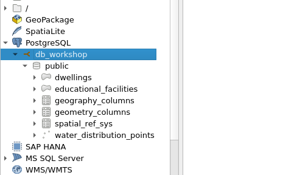

# Exercise 2 Data Structure Design and Creation

In this exercise we will focus on designing and creating the initial database schema for capturing information about:

-   dwellings,

-   water distribution points, and

-   educational facilities

...within the Kutupalong-Balukhali Expansion Site, a refugee camp in Chattogram, Bangladesh.

## Analyzing Requirements and Designing the Data Schema

Now you will delve into the crucial process of analyzing requirements and designing the data schema. Imagine that your manager requested you to generate data about the dwellings, water distribution points, and educational facilities within the refugee camp.

To initiate any data modeling process, it's crucial to tackle the following fundamental question:

-   'What specific information is essential to capture for each dwelling, water distribution point, and educational facility within the refugee camp?'"

By identifying the different aspects to the information you're interested in collecting, we can ensure that the database comprehensively represents the attributes and characteristics of these essential refuge camp components.

First, you need to generate a simple table to represent your data needs, e.g. as follows:

| **Table**                 | **Table Name**            | **Attribute Information**    | **Geometry Type** |
|------------------|------------------|-------------------|------------------|
| Dwellings                 | dwellings                 | capacity, occupancy_status   | Polygon           |
| Water Distribution Points | water_distribution_points | capacity, operational_status | Point             |
| Educational Facilities    | educational_facilities    | facility_type, capacity      | Point             |

## Creating the Necessary Tables

Then, it's time to create the tables with the following SQL that generates three tables and 3 to 4 columns with their corresponding data types:

::: code-box
``` sql
-- Creating the Dwellings table
CREATE TABLE dwellings (
    dwelling_id INTEGER PRIMARY KEY GENERATED ALWAYS AS IDENTITY,
    capacity INTEGER,
    occupancy_status VARCHAR(255),
    geom GEOMETRY(POLYGON, 32646)
);

-- Creating the Water Distribution Points table
CREATE TABLE water_distribution_points (
    point_id INTEGER PRIMARY KEY GENERATED ALWAYS AS IDENTITY,
    capacity INTEGER,
    operational_status VARCHAR(255),
    geom GEOMETRY(POINT, 32646)
);

-- Creating the Educational Facilities table
CREATE TABLE educational_facilities (
    facility_id INTEGER PRIMARY KEY GENERATED ALWAYS AS IDENTITY,
    facility_type VARCHAR(255),
    capacity INTEGER,
    geom GEOMETRY(POLYGON, 32646)
);
```
:::

Note that the code after the geometry type refers to the Coordinate Reference System (CRS). This CRS is commonly used in the UTM (Universal Transverse Mercator) projection for the region around Bangladesh, including our region of interest (Chattogram).

Now you can launch QGIS and browse the tables available through the PostGIS connection you've established. Note that there's no data yet, you can just see that the tables already exist:



Note that you can also see tables like "geography_columns" and "geometry_columns" which come with the PostGIS extension.

Great! Now you've created a few data structures for tables.
