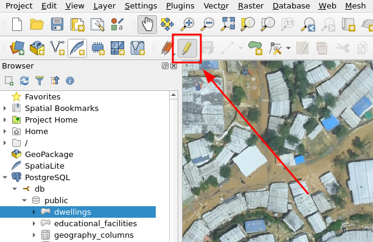
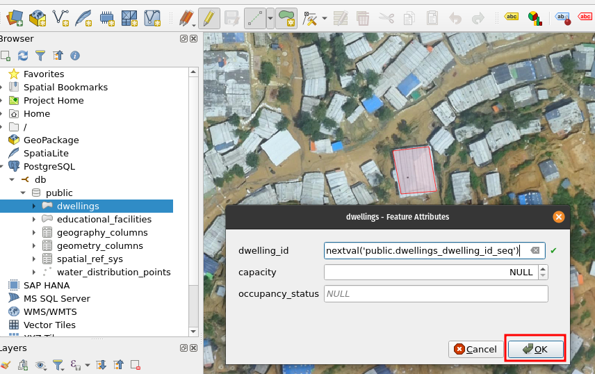
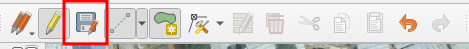
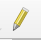
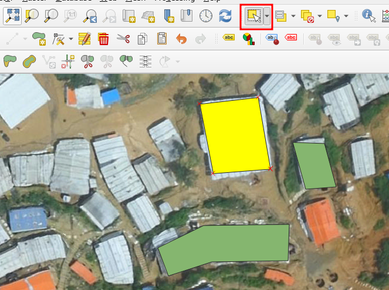

# Exercise 3: Creating and Editing Data in QGIS

Now you will proceed to test the designed data model by creating data within QGIS. This allows you to validate that you will be capturing the required information. Working directly in QGIS, you will experience a first glimpse of integrating QGIS to a database.

## Loading some aerial imagery for context in QGIS

For the sake of the workshop, download some recent aerial imagery that your team and collaborators have acquired from the area of interest from the this link ([in Google Drive](https://drive.google.com/file/d/1d88eDPO95nlpVxwgQ95VurHk07q6s5K0/view?usp=share_link)), and add the .tif-file to your QGIS project:

The data is provided by the International Organization for Migration and if you are interested in the original dataset and some other interesting datasets, read more at: <https://data.humdata.org/dataset/iom-bangladesh-needs-and-population-monitoring-npm-drone-imagery-and-gis-package-by-camp-august-2018>

## Loading the Data and Creating New Features

To proceed with the exercise, you will generate at least two features for each table in the data model.

Load the table: In the "Browser" panel, expand the connected database, navigate to the desired table (e.g., "dwellings"), and double-click on it. The table will be loaded in the QGIS main window as a layer.

Switch to Edit mode: To enable editing on the layer, click on the "Toggle editing" button in the toolbar, or go to the "Layer" menu, select "Toggle Editing." The layer is now ready for creating new features or editing existing ones.

Create a new feature: Click on the "Add Feature" button in the toolbar or go to the "Edit" menu, select "Add Feature." Then, click on the map canvas to add a new feature to the layer. Fill in the attribute values for the feature in the attribute table or in the form that appears.

Save the changes: After making edits or adding new features, save the changes by clicking on the "Save Layer Edits" button in the toolbar.

Now click the save features:

## Editing Existing Features

Now you will explore the editing capabilities of QGIS, allowing you to modify both attribute information and geometries of the features you have just created.

To make changes to attribute information of a feature in QGIS, follow these steps:

You can edit the features attribute information by opening the attribute table and having the edit mode activated, you can edit the attribute information.

To modify the geometry of a feature in QGIS, follow these steps:

1.  Select the feature: Use the selection tool to choose the feature whose geometry you want to edit. Click on the feature directly on the map canvas to select it.

2.  Enable editing: Ensure that the layer is in editing mode with . If not, click on the "Toggle editing" button in the toolbar or go to the "Layer" menu and select "Toggle Editing."

3.  Modify the geometry: With the feature selected, you can move, reshape, or resize it using the various editing tools available in the Advanced Digitizing -toolbar. For example, use the "Move Feature" tool to relocate the feature or the "Node Tool" to edit individual nodes or vertices of the geometry.

    

    

4.  Save the changes: After making the desired changes to either attribute information or geometry, click on the "Save Layer Edits" button in the toolbar or go to the "Layer" menu and select "Save Layer Edits" to save your modifications.

    

## Deleting Unnecessary Features

Then it's time to remove unwanted or unnecessary features in QGIS. Deleting features, one by one, or many at once is simple in QGIS.

To delete one or many features in QGIS, follow this step-by-step guide:

1.  Select the feature(s): Use the selection tool to choose the feature(s) you want to delete.

    

2.  For a single feature, click on it directly on the map canvas. For multiple features, you can either hold down the Ctrl or Shift key while clicking on individual features, or draw a selection box around them by clicking and dragging.

3.  Enable editing: Ensure that the layer is in editing mode with . If not, click on the "Toggle editing" button in the toolbar or go to the "Layer" menu and select "Toggle Editing."

4.  Delete the feature(s): Once the feature(s) is selected, press the Delete key on your keyboard or right-click on any of the selected features and choose the "Delete Selected" option. Confirm the deletion in the prompt that appears.

    
