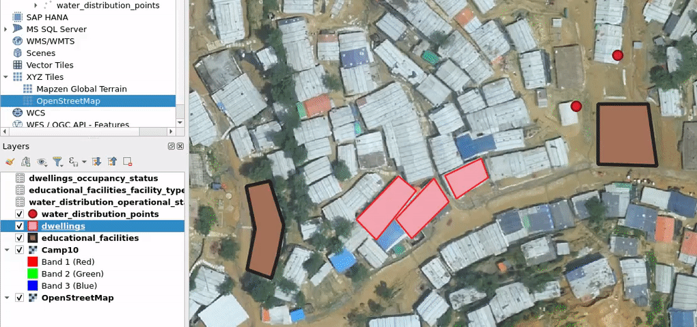
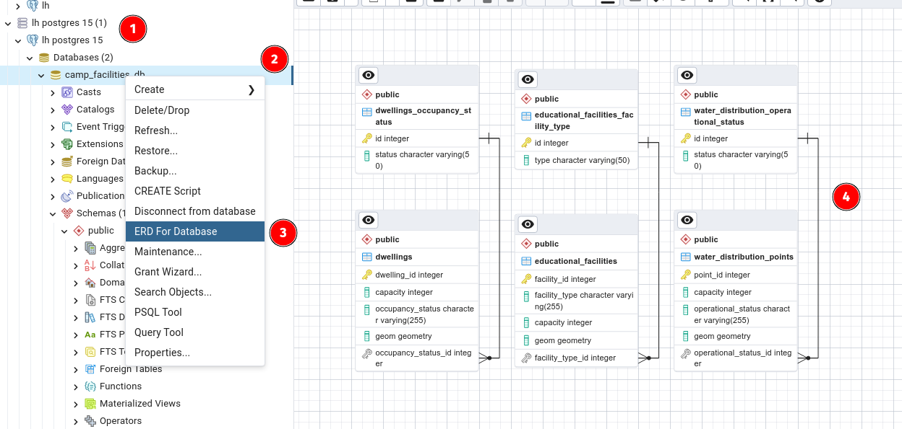

# Exercise 4: Creating Lookup Tables and Utilizing Lookup Values

Now it's time for you to think about data integrity! You have noticed that maintaining consistent and accurate data can sometimes be a challenge. Inconsistent values, misspellings, or different variations of the same category can lead to data quality issues and hinder effective analysis. This is where lookup tables come in, providing a solution to enhance data integrity and improve data entry workflows.

## Identifying Attributes Requiring Predefined Values

By identifying specific attributes that benefit from predefined values, we can ensure consistency and enforce data integrity throughout our database.

Looking at the tables we have created, we can identify certain attributes that require predefined values.

| **Table**                 | **Attribute**      | **Predefined Values**                |
|-----------------------|------------------|-------------------------------|
| Dwellings                 | Occupancy Status   | Occupied, Vacant, Under Construction |
| Water Distribution Points | Operational Status | Active, Temporarily Closed           |
| Educational Facilities    | Facility Type      | School, Vocational Training Center   |

## Creating Lookup/Enumeration Tables

::: code-box
``` sql
-- Lookup table for Dwellings' Occupancy Status 
CREATE TABLE dwellings_occupancy_status ( 
  id INTEGER GENERATED ALWAYS AS IDENTITY PRIMARY KEY, 
  status VARCHAR(50) NOT NULL 
  );

-- Lookup table for Water Distribution Points' Operational Status 
CREATE TABLE water_distribution_operational_status ( 
  id INTEGER GENERATED ALWAYS AS IDENTITY PRIMARY KEY, 
  status VARCHAR(50) NOT NULL 
  );

-- Lookup table for Educational Facilities' Facility Type 
CREATE TABLE educational_facilities_facility_type ( 
  id INTEGER GENERATED ALWAYS AS IDENTITY PRIMARY KEY, 
  type VARCHAR(50) NOT NULL 
  ); 
```
:::

Add foreign keys to the main tables. Foreign keys establish a relationship between tables by linking a column in one table to the primary key column of another table. This ensures data integrity and enables more complex queries and data operations.

## Establishing Relationships with the Main Data Table

By referencing the primary key of one table from a column in another table, you ensure referential integrity and uphold a consistent data structure across multiple tables.

::: code-box
``` sql
-- Add foreign key constraint to Dwellings table
ALTER TABLE dwellings
  ADD COLUMN occupancy_status_id INTEGER,
  ADD CONSTRAINT fk_dwellings_occupancy_status
    FOREIGN KEY (occupancy_status_id)
    REFERENCES dwellings_occupancy_status (id);

-- Add foreign key constraint to Water Distribution Points table
ALTER TABLE water_distribution_points
  ADD COLUMN operational_status_id INTEGER,
  ADD CONSTRAINT fk_water_distribution_operational_status
    FOREIGN KEY (operational_status_id)
    REFERENCES water_distribution_operational_status (id);

-- Add foreign key constraint to Educational Facilities table
ALTER TABLE educational_facilities
  ADD COLUMN facility_type_id INTEGER,
  ADD CONSTRAINT fk_educational_facilities_facility_type
    FOREIGN KEY (facility_type_id)
    REFERENCES educational_facilities_facility_type (id);
```
:::

## Populating the Enumeration Table

Now we will populate the lookup tables with predefined values. You can also edit these afterwords in QGIS.

::: code-box
``` sql
-- Populate Dwellings' Occupancy Status lookup table 
INSERT INTO dwellings_occupancy_status (status) VALUES 
  ('Occupied'), 
  ('Vacant'), 
  ('Under Construction')
;

-- Populate Water Distribution Points' Operational Status lookup table 
INSERT INTO water_distribution_operational_status (status) VALUES 
  ('Active'), 
  ('Temporarily Closed')
;

-- Populate Educational Facilities' Facility Type lookup table 
INSERT INTO educational_facilities_facility_type (type) VALUES 
  ('School'), 
  ('Vocational Training Center')
;
```
:::

## Using the Enumeration Table in QGIS

You can further customize and edit these tables in QGIS. To load them into QGIS, simply double-click the tables from the browser panel, and they will be added to your project. You can visualize and explore the data using the attribute table view in QGIS.



In the next section, we will establish connections between these tables and the main tables, laying the foundation for ensuring data integrity and maintaining consistency in our database.

## Understanding and visualizing the relations between the database tables

If you have installed a relational database management system such as pgAdmin or dBeaver you can visualize the relations. If not, don't worry, simply refer to the image below to gain a clearer understanding of the interrelationships among the tables.

In pgAdmin there's the "ERD for Database" functionality:



Again, if have pgAdmin installed, try this by yourself, following the screenshot numbering:

1.  Make the database connection
2.  Double click the database connection
3.  Choose the ERD for Database functionality
4.  Understand graphically the relations
