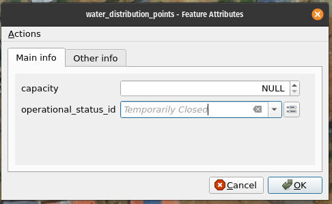
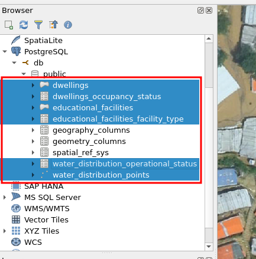
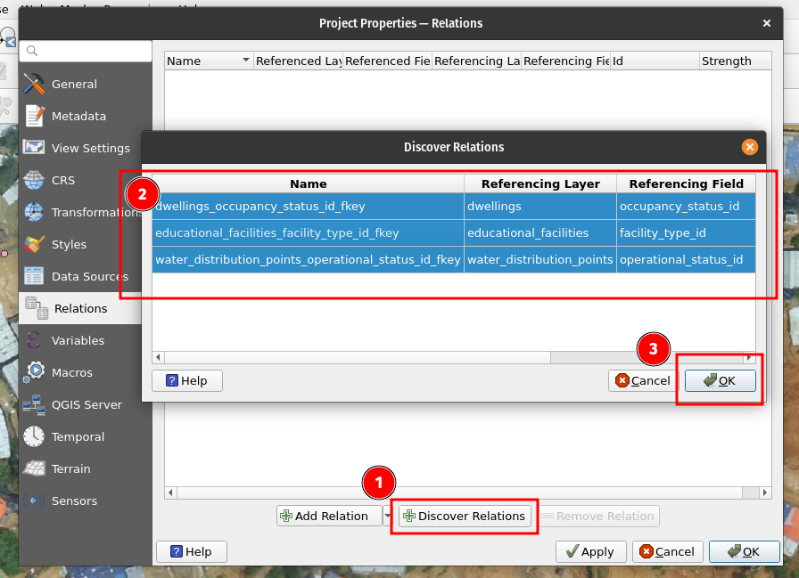
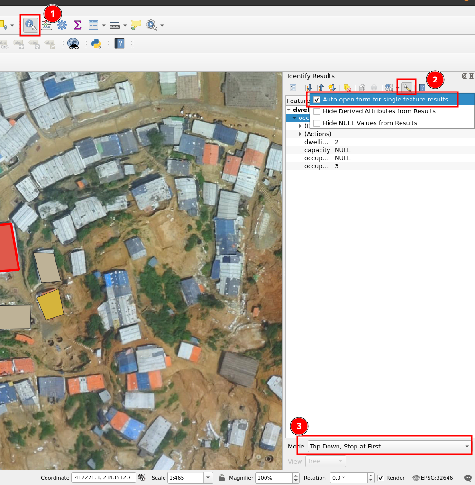
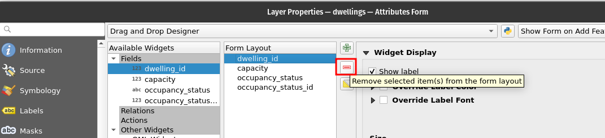

# Exercise 5: Workflow Optimization and Data Entry Forms

Next, we will customize the data entry form in QGIS to facilitate efficient data creation, enabling seamless workflows for both individual work and organization-wide processes.

## Designing a Data Entry Form

QGIS forms are a powerful tool that allows you to create customized data entry interfaces within QGIS. These forms provide a user-friendly way to input and edit attribute data, making it easier to capture and manage information effectively.

QGIS forms can look something like below:

## Discovering table relations in QGIS before setting up the forms

Our goal is to set up a QGIS form, similar to the example shown above. To begin, we need to bring the lookup tables into QGIS. Additionally, since the main tables have been modified, we should reopen them in QGIS. Remember, removing the data from the map window does not erase it from the database. Simply select all six tables and drag & drop or double-click to add them to QGIS.

Next, open the project properties and navigate to the "Relations" section in the side panel.

1.  Select the "Discover Relations" option,

2.  which should display three rows of information representing the relationships between the tables you have created. Choose them all (with CTRL e.g.)

3.  Press Ok

    

## Enabling and Configuring Form Widgets

To enable forms to appear as popup windows, follow these steps:

-   Select the Identify tool (1) in QGIS. This tool allows you to click on a feature and view a small popup window displaying attribute values related to that specific feature (2).

-   To further streamline the process, you can configure QGIS to use the Identify tool for all layers instead of manually selecting a specific layer each time (3).

Then we will can click one of the features and a pop-up window should come up:

We can tailor the form by opening each layer's properties and choosing "Attributes Form":

Using the "Autogenerate" option provides a quick solution, but for more customization, you can opt for the "Drag and Drop Designer" to tailor the form according to your specific requirements. This allows you to have more control over the design and layout of the form.

You can for example remove the id-column from the form so that the user does not see it.

Then we'll get to the good part, where you can see how QGIS already used the relations between the main table and the lookup tables:

1.  After choosing/activating the attribute of interest (in the upper right corner), see how QGIS has setup the "Relation Reference" widget type which refers the capability of the usage of the relation in-between the tables.

2.  QGIS understands that you want to display the "status" text from the lookup table

3.  It refers to the relation you setup earlier.

## Going beyond the basics

There are many widgets in QGIS, like a checkbox for boolean data types, a calendar view for dates and so on. You can explore the list and try to add data types to your main tables and see how the widgets work.

If this seems to much, try the tabs for understanding how you could guide your users to create data.

For example you can setup some tabs in the form:

Here, we are adding a third Tab (in addition to "Main info" and "Other info").
